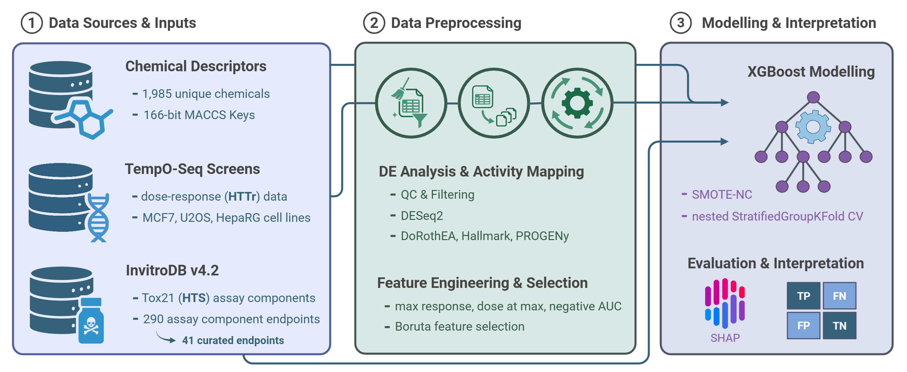

# Mechanistically Interpretable Toxicity Prediction Through Multimodal Integration of Structure and Transcriptomics



<br>

## Overview

This repository contains the complete computational pipeline for predicting chemical toxicity endpoints by integrating molecular structure fingerprints and dose-dependent transcriptomic signatures. The approach combines high-throughput transcriptomics (HTTr) data from three human cell lines (MCF7, U2OS, HepRG) with chemical structure information (MACCS fingerprints) to train interpretable machine learning models for 41 curated Tox21 assay endpoints.

All analyses are included in the `analyses/` directory, with scripts and notebooks that cover data extraction, differential expression analysis, data integration, model training, evaluation, and result interpretation. The `data/` directory contains the necessary datasets, while the `output/` directory stores the results generated from the modeling pipeline, including performance metrics and interpretability analyses. Note: due to file size constraints, some large data files need to be generated using the provided scripts.

<br>

## Repository Structure
```
toxicogenomics_paper/
├── analyses/               
│   ├── 01_assay_database_extraction_and_selection.py
│   ├── 02a_MCF7_DE_analysis.Rmd
│   ├── 02b_U2OS_DE_analysis.Rmd
│   ├── 02c_HepRG_DE_analysis.Rmd
│   ├── 03_combining_and_activity_mapping.Rmd
│   ├── 04_chemical_intergration_and_data_aggregation.ipynb
│   ├── 05_modelling_and_evaluation.py
│   └── 06_results_analyses.ipynb
├── data/                  
│   ├── HTS/               # High-throughput screening assay data
│   ├── HTTr/              # Transcriptomic data and metadata
│   └── chemical/          # Chemical structure and fingerprint data
├── output/              
│   ├── TOX21_PR_BLA_Antagonist_ratio/   # Example assay output directory
│   │   ├── run_summary.json                # Aggregated CV metrics
│   │   ├── run_log.txt                     # Execution log with timestamps
│   │   ├── fold_details.csv                # Per-fold performance breakdown
│   │   ├── oof_predictions.csv             # Out-of-fold predictions
│   │   ├── feature_importance_summary.csv  # XGBoost feature importances
│   │   ├── feature_ranking.csv             # Boruta selection frequencies
│   │   └── shap/                           # SHAP interpretability outputs
│   │       ├── oof_shap.feather               # Aggregated SHAP values (all test samples)
│   │       ├── shap_global_rank_oof.csv       # Global feature ranking
│   │       ├── shap_rank_all_folds.csv        # Feature ranking aggregated across folds
│   │       ├── shap_summary_by_fold.csv       # Summary statistics per fold
│   │       ├── shap_TOX21_PR_BLA_Antagonist_ratio.png     # Paper figure
│   │       └── per_fold/                      # Individual fold SHAP results
│   │           ├── shap_test_fold_1.feather
│   │           ├── shap_rank_fold_1.csv
│   │           └── ...
│   ├── [40 additional assay directories with identical structure]
│   ├── figure_01_feature_reduction_waterfall.png           # Paper figure
│   ├── figure_02_assay_performance_metrics_panel.png       # Paper figure
│   └── table_01_performance_table_paper.csv                # Paper table
└── extra/
```


